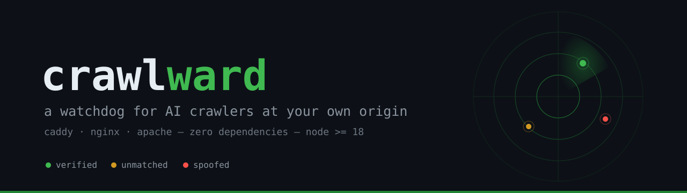
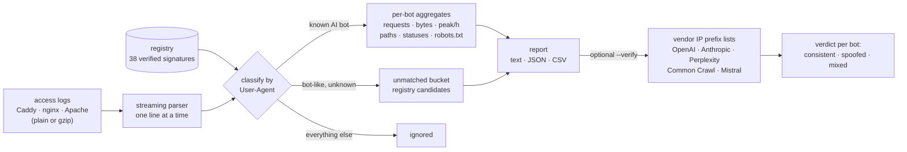

<p align="center">
  
</p>

# crawlward

[](https://github.com/kinti/crawlward/actions/workflows/ci.yml)
[](https://github.com/kinti/crawlward/actions/workflows/codeql.yml)
[](https://github.com/kinti/crawlward/releases)
[](LICENSE)
[](./package.json)
[](./package.json)
[](https://github.com/kinti/crawlward/stargazers)

**A watchdog for AI crawlers at your own origin — for everyone NOT on Cloudflare.**

Cloudflare launched pay-per-crawl and permission-by-default for AI crawlers.
That covers their customers. The rest of the web — self-hosted servers,
Caddy, nginx, cheap shared hosting — has no simple answer to:

- *Who* is actually hitting my site with AI crawlers?
- Do they *respect* my robots.txt — or just claim to?
- How much of my traffic and bandwidth do they eat — and are they who they say they are?

crawlward answers those from data you already have: your access logs.

## Contents

- [Try it in 10 seconds](#try-it-in-10-seconds)
- [How it works](#how-it-works)
- [Quick start](#quick-start)
- [Example output](#example-output)
- [1. Turn on the right access logs](#1-turn-on-the-right-access-logs)
- [The registry](#the-registry)
- [Identity verification](#identity-verification---verify)
- [Comparison](#comparison)
- [FAQ](#faq)
- [Reading the report — known traps](#reading-the-report--known-traps)
- [Roadmap](#roadmap)
- [Contributing · Support · Security](#contributing--support--security)

## Try it in 10 seconds

No logs needed — the repo ships with sample logs (Caddy, nginx and Apache):

```sh
git clone https://github.com/kinti/crawlward.git
cd crawlward
node src/analyze.mjs test/fixtures/*.log --verify
```

The fixtures use documentation IPs (`203.0.113.x`), so every verifiable bot
correctly comes back as *spoofed* — a live demo of the watchdog working.

## How it works



**Privacy:** analysis runs entirely on your machine. Without `--verify` there
is zero network activity; with it, the only requests are GETs to the
vendors' public IP-prefix lists. Your logs never leave your disk.

## Quick start

Point it at your real logs — gzip rotations included:

```sh
node src/analyze.mjs /var/log/caddy/*.log
node src/analyze.mjs /var/log/nginx/example.net.access.log*   # .gz works
node src/analyze.mjs --since 2026-09-01 --verify /var/log/caddy/*.log
```

Machine-readable output for pipelines and dashboards:

```sh
node src/analyze.mjs --json access.log > report.json
node src/analyze.mjs --csv access.log > bots.csv
```

## Example output

```
# crawlward v0.2.1 — who really crawls
files: 3 · lines: 14 · parsed: 13 · unparsed: 1
AI-crawler requests: 10 (76.9% of parsed) · 187 KB served

## AI crawler requests, by bot
requests  share  served   days  peak/h  bot · vendor — purpose
       3   30.0%   100 KB     2       2  GPTBot · OpenAI — model training
       2   20.0%    10 KB     1       2  OAI-SearchBot · OpenAI — ChatGPT search index
       2   20.0%    26 KB     1       2  CCBot · Common Crawl — open corpus (feeds many models)

## HTTP status of AI crawler requests
200: 9 · 404: 1

## Bot-like user agents NOT in the registry
       1  Scrapy/2.11 (+https://scrapy.org)

## Identity verification (--verify: claimed identity vs vendor IP ranges)
GPTBot                 1/1 source IP(s) OUTSIDE vendor ranges (21 prefixes) — treat claimed identity as spoofed
                       outside IP sample: 203.0.113.20
Bytespider             vendor publishes no IP ranges — cannot verify
```

(That output is real, from the test fixtures: their IPs are documentation
ranges, so every verifiable bot correctly fails the vendor check.)

## 1. Turn on the right access logs

Ten minutes of setup, then forget about it:

- **Caddy**: [`caddy/README.md`](caddy/README.md) — `log { format json }` + rotation
- **nginx**: [`docs/nginx.md`](docs/nginx.md) — `log_format ... escape=json` + logrotate
- **Apache**: combined format works as-is, no config needed (client IP feeds
  `--verify`; for Caddy/nginx JSON it comes from `remote_ip`/`$remote_addr`)

The analyzer auto-detects the format per line, tolerates broken lines, and
never needs the whole file in memory.

## The registry

[`registry/crawlers.json`](registry/crawlers.json) is the machine-readable
source of truth: 38 signatures (GPTBot, ClaudeBot, PerplexityBot,
Bytespider, CCBot…), each with the vendor's official documentation URL and
a `verified` flag. [`docs/crawlers.md`](docs/crawlers.md) is the annotated
view — including which tokens are robots.txt-only controls that **never**
appear in logs (`Google-Extended`, `Applebot-Extended`), which vendors
publish IP ranges, and the deliberate scope decisions (why `Googlebot` and
`Bingbot` are not classified as AI crawlers).

## Identity verification (`--verify`)

A User-Agent string is free text — anyone can claim to be `GPTBot`.
`--verify` checks the source IPs of claimed-bot requests against the
vendor's own published prefix lists:

- **all inside** → identity consistent with vendor infrastructure
- **all outside** → treat the claimed identity as spoofed
- **mixed** → usually brand-new vendor ranges, not fraud; inspect
- **no ranges / no client IPs in the log** → reported honestly as
  *cannot verify*

v4-mapped IPv6 addresses (`::ffff:a.b.c.d`, how nginx dual-stack logs
clients) are canonicalized onto the IPv4 table, so dual-stack setups verify
correctly.

## Comparison

Honest positioning — different tools for different situations:

| | crawlward | Cloudflare AI bot controls | robots.txt token lists |
|---|---|---|---|
| Works at | any origin with logs | Cloudflare-proxied sites | n/a (policy, not measurement) |
| Shows what *actually hit* your server | ✅ from your logs | ✅ from their network view | ❌ |
| Catches spoofed identities | ✅ vendor IP ranges | ✅ managed fingerprinting | ❌ |
| Blocks / rate-limits | ❌ (analyzer by design) | ✅ | ✅ (if the bot respects it) |
| Runs locally, logs never leave your machine | ✅ | ❌ | ✅ |
| Cost | free, MIT | part of CF plans | free |

Use crawlward to *know*; use your server config (robots.txt, Caddy/nginx
rules) or a proxy to *act*.

## FAQ

**Does it block bots?**
No, deliberately. It's a watchdog, not a wall: it tells you who crawls,
how hard, and whether they are who they claim. Blocking is one robots.txt
edit or Caddy/nginx rule away once you know.

**Is my log data uploaded anywhere?**
No. Analysis is local. `--verify` only GETs the vendors' public IP lists;
reports are printed to your terminal.

**Why is a bot in "NOT in the registry"?**
Its user agent looks bot-like but matches no known AI-crawler signature —
exactly the finding worth reporting via the *Crawler observation* issue
template.

**Can it read old rotated logs?**
Yes — gzip is detected by content, so `*.log.gz` archives (even renamed)
analyze in place.

**Does it work on Windows / macOS?**
Yes — CI runs the full suite on Ubuntu, macOS and Windows, Node 18–22.

**Why isn't Googlebot counted?**
Scope decision, documented in [docs/crawlers.md](docs/crawlers.md):
classifying all search-crawler traffic as "AI crawler" would swamp reports.
`GoogleOther` is Google's AI-era entry; the training use of Googlebot
content is governed by the `Google-Extended` robots.txt token.

## Reading the report — known traps

1. **UA strings are claims; `--verify` checks them.** IP-prefix matching
   confirms requests come from vendor infrastructure. It can still miss
   brand-new ranges (vendors add IPs constantly) — a MIXED result usually
   means new ranges, not fraud.
2. **robots.txt respect ≠ permission respect.** A bot can fetch
   `/robots.txt` once, cache it for weeks, and still be a good citizen — or
   ignore it silently. User-triggered fetchers (ChatGPT-User,
   Perplexity-User, meta-externalfetcher, Google-Agent…) bypass robots.txt
   by design. crawlward reports the signal; you judge the behavior.
3. **Absence of evidence isn't evidence of absence.** Zero hits from a
   vendor doesn't mean zero crawling: content can reach models via Common
   Crawl or client-side aggregators.
4. **`Google-Extended` and `Applebot-Extended` will never appear in your
   logs.** They're robots.txt control tokens with no HTTP user-agent of
   their own. Any report claiming requests from them is wrong.

## Roadmap

- [x] Identity verification against vendor-published IP ranges (`--verify`)
- [ ] robots.txt diffing: what *you* allow vs what *they* do
- [ ] HTML report output
- [ ] More log formats (Traefik, Caddy `console` format)
- [ ] FCrDNS verification as complement for vendors without prefix lists

## Status

v0.2.1 — tested (39 test cases, CI on Linux/macOS/Windows, Node 18–22) and
[code-scanned with CodeQL](https://github.com/kinti/crawlward/security/code-scanning).
The signature registry is verified against vendor documentation as of
September 2026; vendors rename and add bots often, so issues and PRs are
the maintenance model. See [CHANGELOG.md](CHANGELOG.md).

## Contributing · Support · Security

- Registry corrections and code: [CONTRIBUTING.md](.github/CONTRIBUTING.md) —
  every entry needs the vendor's official doc URL
- Real-world findings: open an issue with the *Crawler observation* template
- Questions and ideas: [Discussions](https://github.com/kinti/crawlward/discussions)
- Vulnerabilities: [SECURITY.md](.github/SECURITY.md) — private reporting welcome
- Citing crawlward: see [CITATION.cff](CITATION.cff) (GitHub's *"Cite this
  repository"* button)

## License

[MIT](LICENSE) — © Jesús Quintana
